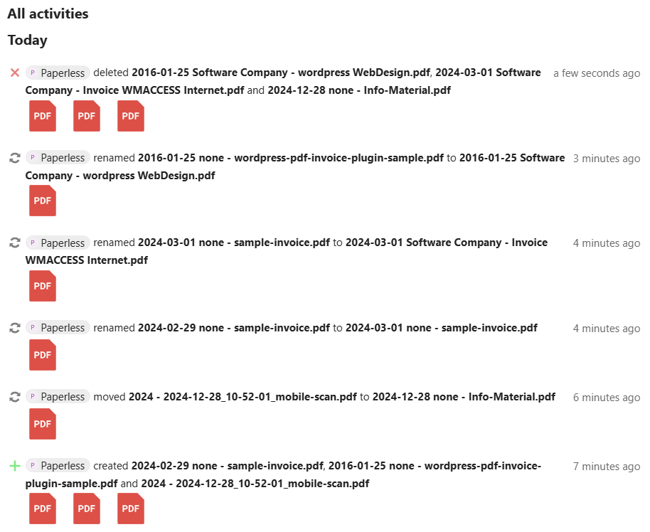

# Paperless-ngx to Nextcloud Real-Time Synchronization via WebDAV

This Docker image mounts a remote WebDAV source and synchronizes the data from `/mnt/source` to the mounted WebDAV drive in real-time. It is specifically designed for Nextcloud but may also work with other cloud systems that use WebDAV.

## Why this Project?
This project provides a seamless way to connect Paperless and Nextcloud, overcoming limitations found in other solutions. It fulfills the following key requirements:

- **Easy and quick** configuration.
- Synchronization with **remote Nextcloud instances**.
- Files created, deleted, or modified appear in Nextcloud’s **Activity Feed**.
- PDFs can be fund using the **search within Nextcloud**.
- **Real-time synchronization**.

> [!NOTE]  
> Synchronization is unidirectional (<b>Paperless ➔ Nextcloud</b>) to ensure Paperless’ data integrity.

<details>
<summary>Click here to see a graphical overview of the container's functionality:</summary>


</details>

<details>
<summary>Here's a comparison between the data exchange options for Paperless and Nextcloud:</summary>

|                                         | Nextcloud <br>Paperless App | Local Mount | SFTP or <br>SMB/CIFS ¹ | This Container  |
| --------------------------------------- | --------------------------- | ----------- | ---------------------- | --------------- |
| Easy SetUp                              | ✅                          | ✅          | ✅                     | ✅ ²            |
| Paperless Files available in Nextcloud  | ❌                          | ✅          | ✅                     | ✅              |
| Send files to Paperless consume (File input) | ✅ ³                   | ☑️ ⁴        | ☑️ ⁴                   | ❌ ³            |
| Services on another Host (same Network) | ✅                          | ❌          | ✅                     | ✅              |
| remote Services                         | ✅                          | ❌          | ☑️ ⁵                   | ✅              |
| Files available in the Nextcloud Search | ❌ ³                        | ❌          | ❌                     | ✅              |
| Recent Paperless-changes available in Nextcloud Activity App | ❌ ³   | ❌          | ❌                     | ✅              |
| Paperless Files backed up in Nextcloud ⁶ | ❌ ³                       | ❌          | ❌                     | ✅ ⁶            |
| Works with both: Docker and Bare-Metal  | ✅                          | ✅ ⁷        | ✅ ⁷                   | ✖️ ⁸            |

¹ Additional FTP or SMB/CIFS service required  
² see prerequisites  
³ Nextcloud Paperless App: Nextcloud → Paperless / this container: Paperless → Nextcloud  
⁴ a second external mount with writing permission required  
⁵ only SFTP (SMB/CIFS not recommended over the Internet!)  
⁶ this does NOT replace a regular backup including the Paperless Database   
⁷ for Docker: ensure correct mounting  
⁸ untested. Probably won't work OOTB and requires a more complex set-up  
</details>

<br>

---

## Preparation

You may configure the [Paperless File name handling](https://docs.paperless-ngx.com/advanced_usage/#file-name-handling) first.

### Requirements
- Administrative access to Nextcloud for adjusting user and brute-force settings.
- Dedicated Nextcloud account with read-write permissions for the synchronization container.

### Adjustments in Nextcloud
1. **Create a Dedicated Account**
   - Also **create a dedicated folder** for synchronization and sharing across your nextcloud.
   - Then share the folder as **read-only** with users/groups to maintain data consistency.
2. **Brute-Force Settings**
   - Set log level **Info** - to view throttled events in the log.
   - Add the container’s IP to the whitelist in Nextcloud to prevent throttling during initial synchronization.

> [!TIP]
> Are you struggling with this short description? <a href="https://github.com/Flo-R1der/paperless-nextcloud-sync/blob/main/documentation/README.md">Read the full documentation</a>.

<br>

---

## Installation and Setup

### Steps

1. Add the container to your Paperless stack using Docker Compose:
   ```yaml
     nc-sync:
       image: flor1der/paperless-nextcloud-sync:latest
       volumes:
         - "/var/lib/docker/volumes/paperless_media/_data/documents/archive:/mnt/source:ro"
         - "./nc-sync_logs/:/var/log/"
       environment:
         WEBDRIVE_URL: $NEXTCLOUD_URL
         WEBDRIVE_USER: $NEXTCLOUD_USER
         WEBDRIVE_PASSWORD: $NEXTCLOUD_PASSWORD
         TZ: Europe/Berlin
       privileged: true
       devices:
         - "/dev/fuse"
   ```

2. Replace my placeholders and define environment variables:
   - Under `volumes:` specify the **mount-point of your document library**
   - Fill in the **`WEBDRIVE_URL`, `WEBDRIVE_USER`, and `WEBDRIVE_PASSWORD`** values.
	   - The `WEBDRIVE_URL` must be the **WebDAV-URL of the folder** created under [Preperation](#preparation)
      - Use app passwords if two-factor authentication is enabled 
	   - If you want to utilize [Docker secrets](https://docs.docker.com/compose/how-tos/use-secrets/) use `WEBDRIVE_PASSWORD_FILE` instead of `WEBDRIVE_PASSWORD`.
   - **Optional**: Define webdrive mounting options using `DIR_USER`, `DIR_GROUP`, `ACCESS_DIR`, and `ACCESS_FILE`.
   - **Optional**: set `LC_ALL` and `LANG` to any value from [this table](https://docs.oracle.com/cd/E23824_01/html/E26033/glset.html#glscx) if you experience filename issues with special characters.

3. Restart your Paperless instance to activate the container.

4. Verify the container is running:
   ```bash
   docker logs --follow <container-name>
   ```

> [!TIP]
> Are you struggling with this short description? <a href="https://github.com/Flo-R1der/paperless-nextcloud-sync/blob/main/documentation/README.md">Read the full documentation</a>.

### Container Start
- The WebDAV drive will be mounted.
- The initial synchronization is started as background-job.
- A file watcher monitors changes in real-time.
- If WebDAV and file watcher is running: the container’s health status shows "healthy".
- Logs provide detailed information about the synchronization process.


### Expected Results
- Initial synchronization uploads existing files, that are not existing in Nextcloud, newer in Paperless or moved/renamed.
- New files in Paperless are transferred to Nextcloud and appear in the Activity Feed:  


<br>

## Open Topics
- [ ] Replace initial synchronization with a better solution. My tests with `rsync` caused file deletions during synchronization, which my script avoids but still produces error messages (see [log example](documentation/container-logs_example.txt), lines 20-24). **Please open issues only if you have a suitable solution!**

<br>

---

## Like My Work?
[](https://ko-fi.com/I3I4160K4Y)
