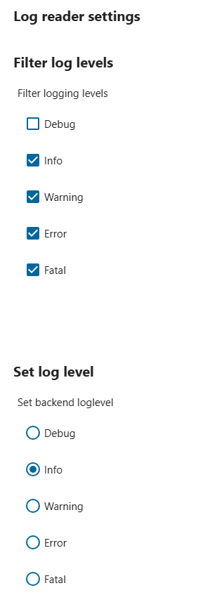
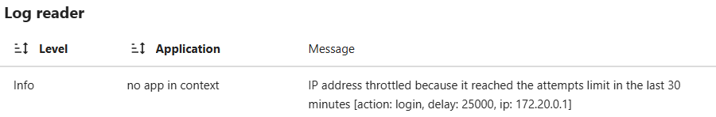
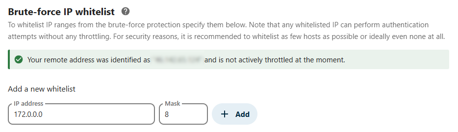
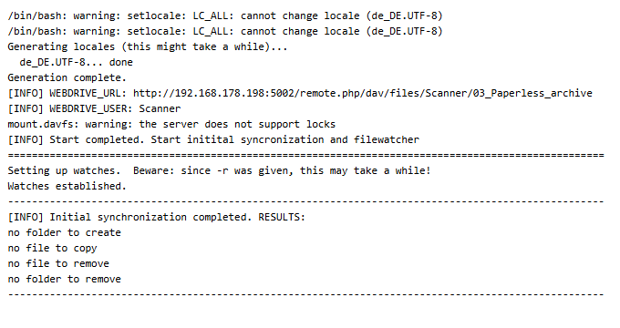
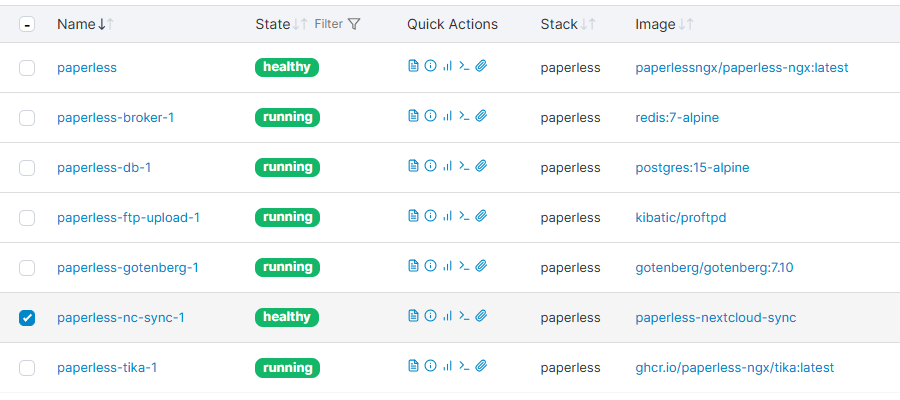

# Paperless-ngx to Nextcloud Real-Time Synchronization via WebDAV

This Docker image mounts a remote WebDAV source and synchronizes the data from `/mnt/source` to the mounted WebDAV drive in real-time. It is specifically designed for Nextcloud but may also work with other cloud systems that use WebDAV.  

The synchronization process is intended to be real-time and seamless. Once the WebDAV connection is successfully established, two mechanisms are employed:

- **Bulk Migration**: Automatically initiated to transfer all existing files, that are not available or outdated at the target webdrive.
- **File Watcher**: Enables real-time synchronization during runtime, handling the following operations:
  - File/Folder creation
  - File/Folder deletion
  - File moves and renames
  - File updates, creating new versions (e.g., rotated pages, new OCR runs, etc.)

<br>

❤ A special thanks to [efrecon](https://github.com/efrecon) / [docker-webdav-client](https://github.com/efrecon/docker-webdav-client) for providing the foundation for this project!

<br>

## Why this Project?
I was looking for a seamless way to connect Paperless and Nextcloud. During my research, I tested several existing solutions, but they all had drawbacks that I found unacceptable. This project aims to meet the following **requirements**:

- **Easy to configure** and ready to use within minutes.
- Supports synchronization with **remote Nextcloud instances**.
- Created, deleted, or modified files should appear in **Nextcloud's Activity Feed**.
- PDFs should be **searchable within Nextcloud**.
- Changes should be **synchronized as soon as possible**.

To achieve these goals, approaches like directly mounting the export directory to Nextcloud or connecting a Paperless stack to an FTP server proved unsuitable. As a result, I developed this custom Docker container. It uses WebDAV mounts to synchronize files and folders based on events.

<details>
<summary>Click here to see a graphical overview of the container's functionality:</summary>


</details>

<details>
<summary>Here's a comparison between the data exchange options for Paperless and Nextcloud:</summary>

|                                         | Nextcloud <br>Paperless App | Local Mount | SFTP or <br>SMB/CIFS ¹ | This Container  |
| --------------------------------------- | --------------------------- | ----------- | ---------------------- | --------------- |
| Easy SetUp                              | ✅                          | ✅          | ✅                     | ✅ ²            |
| Paperless Files available in Nextcloud  | ❌                          | ✅          | ✅                     | ✅              |
| Send files to Paperless consume (File input) | ✅ ³                   | ☑️ ⁴        | ☑️ ⁴                   | ❌ ³            |
| Services on another Host (same Network) | ✅                          | ❌          | ✅                     | ✅              |
| remote Services                         | ✅                          | ❌          | ☑️ ⁵                   | ✅              |
| Files available in the Nextcloud Search | ❌ ³                        | ❌          | ❌                     | ✅              |
| Recent Paperless-changes available in Nextcloud Activity App | ❌ ³   | ❌          | ❌                     | ✅              |
| Paperless Files backed up in Nextcloud ⁶ | ❌ ³                       | ❌          | ❌                     | ✅ ⁶            |
| Works with both: Docker and Bare-Metal  | ✅                          | ✅ ⁷        | ✅ ⁷                   | ✖️ ⁸            |

¹ Additional FTP or SMB/CIFS service required  
² see prerequisites  
³ Nextcloud Paperless App: Nextcloud → Paperless / this container: Paperless → Nextcloud  
⁴ a second external mount with writing permission required  
⁵ only SFTP (SMB/CIFS not recommended over the Internet!)  
⁶ this does NOT replace a regular backup including the Paperless Database   
⁷ for Docker: ensure correct mounting  
⁸ untested. Probably won't work OOTB and requires a more complex set-up  
</details>

<br>

> [!IMPORTANT]  
> Synchronization works in only one direction: **Paperless ➜ Nextcloud**. Since Paperless manages the data, any modifications to the export directory by Nextcloud could corrupt the Paperless instance.

> [!TIP]
> You are interested how I upload my Scans from my network-scanner or mobile device (even remotely), you can also take a look into my [short summary for pdf upload](readme_ftp-upload.md).

<br>

## Preparation

You may configure the [Paperless File name handling](https://docs.paperless-ngx.com/advanced_usage/#file-name-handling) first. The PDF files in Paperless are named based on their internal ID which didn't tell much when transferred to Nextcloud.

### User and Share Settings
For WebDAV synchronization, it is recommended to use a **dedicated account**, if possible. This account should be linked to the synchronization container (effectively with read-write permissions) and configured to share the synchronized folder/files with other users or groups with **read-only permissions**. This ensures that no changes are made to the PDF files and makes it easier to trace which files are controlled by Paperless.  
To create a new user, log in as an administrator, navigate to the User Administration, and follow [the official guide](https://docs.nextcloud.com/server/latest/admin_manual/configuration_user/user_configuration.html#creating-a-new-user).

<details>
<summary>Example Activity Feed</summary>


</details>

### Brute-Force Settings
During the initial synchronization, depending on the number of files being transferred, your container may be throttled by your Nextcloud instance. While this brute-force protection is a valuable security feature, it can cause issues during bulk file transfers. To address this, you can:

1. Log in as an administrator, navigate to Administration Settings > Logging, click on Log Reader Settings, enable **Filter log level: Info**, and activate **Set log level: Info** to view throttled events in the log.
    <details>
    <summary>Screenshot: Log Settings</summary>
    
    
    </details>

2. Log in as an administrator, navigate to Administration Settings > Security (in the Administration section, not the Personal section), and **add the IP of your synchronization container** to the whitelist.
    <details>
    <summary>Screenshot: IP Address throttled and Brute-Force IP Whitelist</summary>

    
    
    > [!NOTE]  
    > By whitelisting `172.0.0.0/8`, all IP addresses starting with `172.*` are included. These are typical Docker IP addresses. If you are using a public instance, consider the possibility of dynamic IP address changes. To calculate IP address masks accurately, an [IP Calculator](https://jodies.de/ipcalc) is recommended.
    </details>

<br>

## Installation and Setup
1. Add the container to your Paperless instance, preferably via **[Docker Compose](https://docs.docker.com/compose/)** or **[Portainer Stack](https://docs.portainer.io/user/docker/stacks/edit)**.
    - You can use and edit the following block:
        ```yaml
          nc-sync:
            image: paperless-nextcloud-sync
            volumes:
              - "/var/lib/docker/volumes/paperless_media/_data/documents/archive:/mnt/source:ro"
            environment:
              WEBDRIVE_URL: $NEXTCLOUD_URL
              WEBDRIVE_USER: $NEXTCLOUD_USER
              WEBDRIVE_PASSWORD: $NEXTCLOUD_PASSWORD
              LC_ALL: de_DE.UTF-8
              TZ: Europe/Berlin
            privileged: true
            devices:
              - "/dev/fuse"
        ```
        > [!IMPORTANT]  
        > `privileged: true` and `devices: "/dev/fuse"` are mandatory for WebDAV mounts.

2. Replace my placeholders and define environment variables:
    - Under `volumes:` specify the **mount-point of your document library**
    - Fill in the `WEBDRIVE_URL`, `WEBDRIVE_USER`, and `WEBDRIVE_PASSWORD` values.
        - **Video**: [How to find WebDAV url in Nextcloud](https://www.youtube.com/watch?v=D1JU9vogekU)
        - **Video**: [How to create an app password in Nextcloud](https://www.youtube.com/watch?v=HQZyzlo82G4) - This is mandatory, if **Two-Factor-Authentication** is enabled for the Account you want to use! Otherwise, you can use the usual account password.
        - **Optional**: Use the environment variable `WEBDRIVE_PASSWORD_FILE` instead of `WEBDRIVE_PASSWORD` if you want to utilize [Docker secrets](https://docs.docker.com/compose/how-tos/use-secrets/).
    - **Optional**: Define mounting options using `DIR_USER`, `DIR_GROUP`, `ACCESS_DIR`, and `ACCESS_FILE`. This can be useful if you also want the WebDAV drive mapped to a mount point on the Docker host.
    - **Optional**: The image is build with `LC_ALL=en_US.UTF-8` and `LANG=en_US.UTF-8`. For the most occasions this should be suitable and you can delete that line from the config file above. Otherwise, set it to any value from [this table](https://docs.oracle.com/cd/E23824_01/html/E26033/glset.html#glscx).


3. Restart the Paperless instance to activate the container.

4. Verify if the container is running and check the container logs:
    - Use `docker logs --follow <container-name>` (replace `<container-name>` with your container's name) or utilize the [Portainer Log Viewer](https://docs.portainer.io/user/docker/containers/logs).

        <details>
        <summary>Example screenshot</summary>

        
        </details>

        Alternatively: compare the output to the more detailed [log example](container-logs_example.txt), if necessary.

<br>

## Startup
On the first run, always inspect the container logs. The logs should include the following:
1. The container sets locales if `LC_ALL` is configured with a value other than `en_US.UTF-8`. This ensures support for non-ASCII characters in filenames.
2. The container validates mandatory environment variables (`WEBDRIVE_URL`, `WEBDRIVE_USER`, `WEBDRIVE_PASSWORD`). If any are missing, the container exits with code 1.
3. If configured correctly, the WebDAV drive (Nextcloud) is mounted via `davfs`. Errors during mounting will stop the container with exit code 1.
4. Upon successful mounting: The **Initial synchronization** and **file-watcher** are started to detect changes and keep Nextcloud synchronized with Paperless.

    <details>
    <summary>Technical details: after WebDAV is mounted</summary>

    - Sets a `trap` to unmount the drive properly when a stop signal is received.
    - Initiates `sync.sh` for initial synchronization to update Nextcloud in the background.
        > [!NOTE]  
        > While `rsync` could achieve similar results, it has caused file deletions during initial synchronization in my tests. My script avoids this issue, though some errors are still logged. Please share any better solutions!
    - Configures the file watcher `inotifywait` to monitor changes by Paperless:
        - **CREATE**: Copies new files/folders from Paperless to Nextcloud.
        - **MODIFY**: Updates files in Nextcloud, creating new document versions (e.g., rotated pages, new OCR runs, etc.).
        - **DELETE**: Deletes corresponding files in Nextcloud.
        - **MOVED_FROM** and **MOVED_TO**: Handles file renaming or moving, using paths provided in these events.
    </details>

<br>

## Expected Results
1. When started, the **health check** verifies WebDAV mounting and file watcher operation. If successful, the container is marked **healthy**.
    <details>
    <summary>Portainer screenshot: Container is <b>started and healthy</b></summary>

    
    </details>

2. After successful startup (indicated in logs by a `=====` line):
    - The file watcher waits for events and synchronizes Nextcloud accordingly (refer to the technical details in point 4 from the Startup section).
    - Initial synchronization compares source and Nextcloud directories to sync changes made while the container was offline. This process also uploads existing files during the first run.
    - Completion of initial synchronization is logged, enclosed by `-----` lines.
        <details>
        <summary>Example screenshot</summary>

        
        </details>

        Alternative: Refer to the detailed [log example](container-logs_example.txt), if necessary. For this example also take into account the technical details in point 4 from the Startup section.

3. If you are creating Documents in Paperless, they will be transferred to your Nextcloud immediately and appear as created, deleted, or modified files in Nextcloud's Activity Feed:


<br>

## Like My Work?
[](https://ko-fi.com/I3I4160K4Y)
